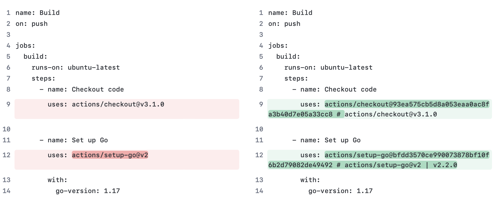
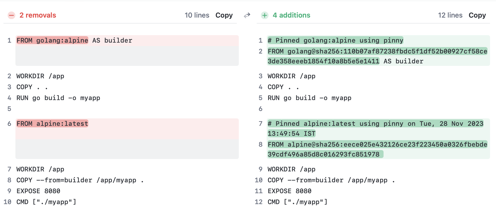

# Pinny

Hash-pinning for your OSS dependencies to protect against [repojacking](https://github.com/koalalab-inc/pinny/blob/main/docs/Secure-by-design-OSS.md) and [imposter commits](https://github.com/koalalab-inc/pinny/blob/main/docs/impostorcommits.md).

Pinny currently supports pinning Dockerfiles and Github Actions workflows.

# Why

Software supply chain attacks are on the rise, with [742% increase in new-age supply chain attacks from 2019-2022](https://linuxfoundation.eu/newsroom/the-rising-threat-of-software-supply-chain-attacks-managing-dependencies-of-open-source-projects).
The use of OSS dependencies opens up organizations to a lot of software supply chain attack vectors like [repojacking and dependency confusion](https://github.com/koalalab-inc/pinny/blob/main/docs/Secure-by-design-OSS.md). Automated hash-pinning is a practice that helps against such attacks.

### Hash-Pinning:

OSS images can be referenced by image tags or hashes/digest. 
Images referenced by tag are mutable. The maintainer could push a new image with the same TAG and all downstream application using that image and TAG could break.

Images referenced by hash are immutable. Even if there is a new image pushed with the same tag, the new image will have a new hash/digest. The previous image can still be referenced by the previous hash.

<hr />

# Contents
* [Example](#example)
    * [Pinning Github Actions workflows](#pinning-github-actions-workflows)
    * [Pinning Dockerfiles](#pinning-dockerfiles)
* [Usage](#usage)
    * [Github Actions](#github-actions)
    * [Dockerfiles](#dockerfiles)
* [Installation](#installation)
    * [Docker image](#docker-image)
    * [Precompiled binary](#precompiled-binary)

## Example:
* #### Pinning Github Actions workflows
    
* ##### Sample run on the Github workflows of Akto Github repository
    

* #### Pinning Dockerfiles
    
* ##### Sample run on the Dockerfile of Metabase Github repository
    

## Usage:
* #### Github Actions
    To pin your Github Actions workflows, run the following command in your repository root. This will transform all the workflows in your repository to use pinned versions of the actions. 
    ```bash
    pinny actions pin
    ```
    or if you are being rate limited by Github's API
    ```bash
    GITHUB_TOKEN=<your_token> pinny actions pin
    ```
    You can use the `--dry-run` flag to see what changes will be made before actually making them.

    To learn more
    ```bash
    pinny actions --help
    ```

* #### Dockerfiles
    Pinny supports two workflows for pinning of dockerfiles.
1. ##### Pinning your files locally before you commit them
    To pin your Dockerfile, run the following command in your repository root. This will look for file named `Dockerfile` in your repository root and will create a new file named `Dockerfile.pinned` with pinned versions of all the base images.
    ```bash
    pinny docker pin
    ```
    Use `--inplace` or `-i` flag to overwrite the original Dockerfile instead of creating a new file.
    ```bash
    pinny docker pin --inplace
    ```
    Use `--file` or `-f` flag to specify a different file name.
    ```bash
    pinny docker pin --file Dockerfile.dev
    ```

1. ##### Generate and commit a lock file and pin your dockerfiles in CI
    * ###### Generate a lock file
        To generate a lock file, run the following command in your repository root. This will look for file named `Dockerfile` in your repository root and will create a file named `pinny-lock.json` with pinned versions of all the base images.
        ```bash
        pinny docker lock
        ```
        Use `--file` or `-f` flag to specify a different file name.
        ```bash
        pinny docker lock --file Dockerfile.dev
        ``` 
        
        To learn more
        ```bash
        pinny docker lock --help
        ```
    * ###### Tranform your dockerfiles in CI
        Once you have committed the lock file, you can use the following command in your CI to transform your dockerfiles to use pinned versions of the base images.
        ```bash
        pinny docker transform
        ```
        Use `--file` or `-f` flag to specify a different file name.
        ```bash
        pinny docker transform --file Dockerfile.dev
        ```
        Use `--inplace` or `-i` flag to overwrite the original Dockerfile instead of creating a new file.
        ```bash
        pinny docker transform --inplace
        ```
        `This command requires you have a file named pinny-lock.json.`<br/>
        To learn more
        ```bash
        pinny docker tranform --help
        ```

## Installation:
* #### Docker image
    Get the version from the releases section and run the following command(Replace 0.0.9 with the version you want to use)
    ```bash
    docker run -v "$(pwd):/app" -w /app -u $(id -u):$(id -g) ghcr.io/koalalab-inc/pinny:0.0.9 docker digest alpine:3.18
    ```
    You can alias this command to `pinny` for ease of use
    ```bash
    alias pinny='docker run -v "$(pwd):/app" -w /app -u $(id -u):$(id -g) ghcr.io/koalalab-inc/pinny:0.0.9'
    ```
* #### Precompiled binary
    Get the version from the releases section and run the following command(Replace version, os and arch as per your system)<br />
    Following command will download the archive containing binary for MacOS x86_64
    ```bash
    curl -fsSL https://github.com/koalalab-inc/pinny/releases/download/v0.0.9/pinny_Darwin_x86_64.tar.gz 
    ```

    To download and place the binary in `/usr/local/bin` run the following command
    ```bash
    curl -fsSL https://github.com/koalalab-inc/pinny/releases/download/v0.0.9/pinny_Darwin_x86_64.tar.gz | tar -xz -C "/usr/local/bin/" "pinny"
    ```

    On MacOS, if you get an error like `Cannot Verify That This App is Free from Malware` Or `This app is from an unidentified developer`, you can run the following command to allow the binary to run
    ```bash
    sudo xattr -d com.apple.quarantine /usr/local/bin/pinny
    ```
